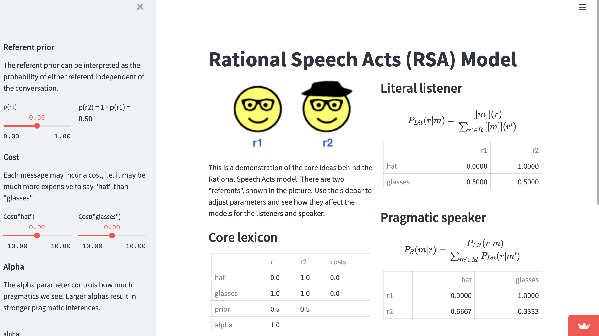

# Rational Speech Acts (RSA) Model Demo

This contains code for a simple demo of the RSA model, where one can adjust the referent priors and message costs as well as the hyperparameter alpha, and see the effects on the various agents (literal listener, rational speaker, and rational listener).

Introduction to RSA from Chris Potts: https://www.youtube.com/watch?v=bPd6CNy5UqA
